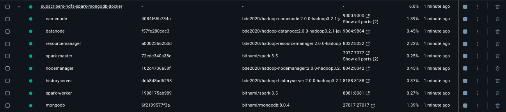
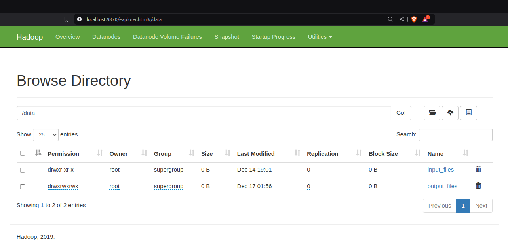
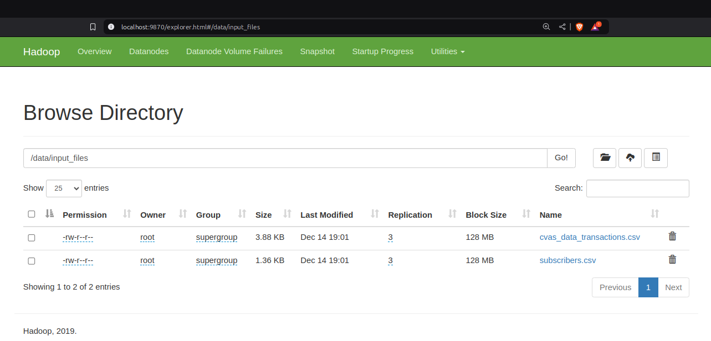
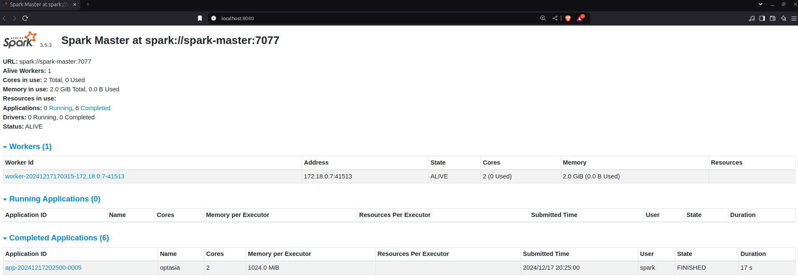
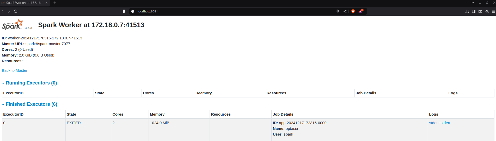
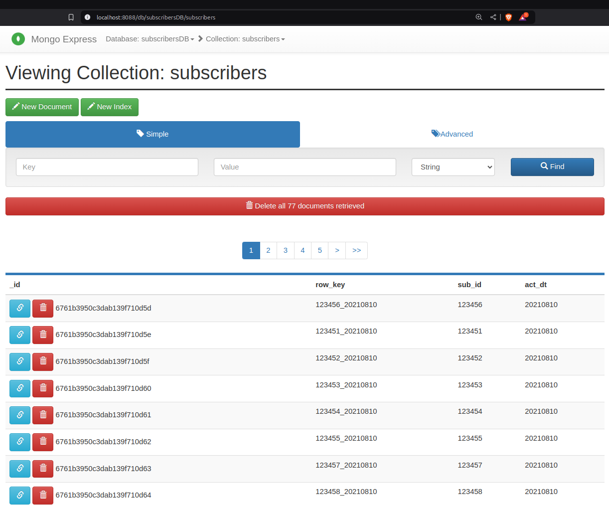
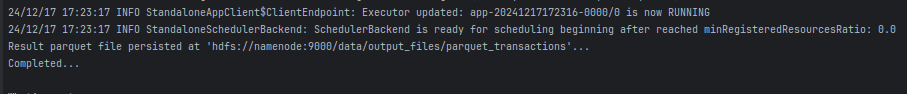
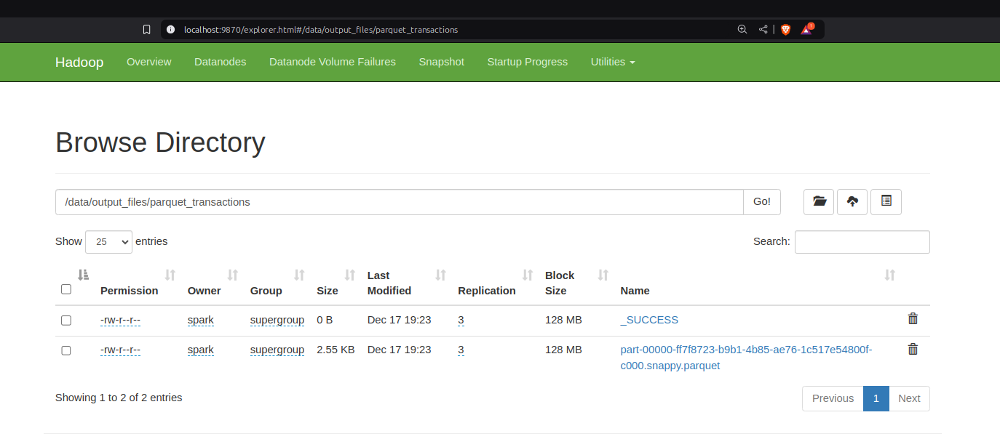
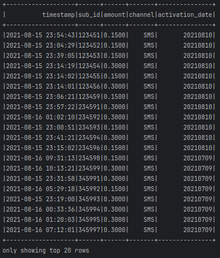

# ETL process using Apache Hadoop (HDFS), Apache Spark, MongoDB and Docker

## System Architecture
The system is containerized and orchestrated using Docker Compose for ease of deployment.

### Environment
   - Docker Desktop v4.36.0 and Docker Compose version v2.30.3-desktop.1
   - Ubuntu 24.04

Note: If you are using Windows, consider using Git Bash or Windows Subsystem for Linux (WSL)

### Key Components
The project is composed of three main modules:
1. Data Ingestion:
   - Reads csv data and stores into HDFS
2. Data Transformation:
   - Cleans, processes, and prepares the data from HDFS using PySpark
3. Data Persistence:
   - Persists the processed data into MongoDB (NoSQL)
   - Saves final records in Parquet format on HDFS

## Technologies Used
  - Python: Main programming language for ETL implementation
  - Apache Hadoop: HDFS for distributed storage
  - Apache Spark: Distributed computation with PySpark
  - MongoDB: NoSQL database for persisting records
  - Mongo Express: MongoDB Web UI
  - Parquet: Optimized columnar storage format
  - Docker & Docker Compose: Containerized services for Apache Hadoop, Spark, and MongoDB
  
## Hands-on
### Clone the repository
```
git clone https://github.com/dimitriszrv/subscribers-hdfs-spark-mongodb-docker.git
```

### Go to project
```
cd subscribers-hdfs-spark-mongodb-docker/
```

### Build project using docker-compose.yml file
All containers are build up and running with:
```
make build
```


### Setup HDFS
Using this command, two folders, data/input_files and data/output_files will be created, where folder data/input_files 
stores the input csv files from assignment folder
```
make hdfs-setup
```
HDFS is accessible using: 
- Namenode: http://localhost:9870/
- Datanode: http://localhost:9864/
- Application history: http://localhost:8188/
- Node manager: http://localhost:8042/

Clicking at Utilities > Browse the file system > data, we see the input_files and output_files folders


Input files



### Setup Spark environment
Now it's time for Spark. To init Spark environment, use:
```
make spark-setup
```

### Run Spark
Run Spark in order to read csv files, transform data and store it into MongoDB, then merge transactions with subscribers and persist result into parquet 
```
make run-spark
```
Spark is accessible using: 
- Spark-Master: http://localhost:8080/
- Spark-Worker: http://localhost:8081/

Spark-Master:
<br><br>

Spark-Worker:
<br><br>

MongoDB is accessible using Mongo Express: 
- MongoDB: http://localhost:8088/ with username: root,  password: root

MongoDB with collection subscribers
<br><br><br>
Terminal output that job completed<br>
<br><br>
Output files<br>
 

### Run query 
In order to run query using the parquet file, specify your query at query.sql file<br>
ex. SELECT * FROM transactions WHERE amount < 0.5 ORDER BY sub_id ASC
```
make run-query
```
 

**If you want a different query to be executed, just update the query.sql file and then execute: make run-query**<br>
(please make sure you have done all the previous steps in order)

### How to use Makefile

- build and start containers: make build
- start containers: make up
- stop containers: make stop
- remove containers: make remove
- show logs: make logs
- setup hdfs directories: make hdfs-setup
- setup spark environment: make spark-setup
- run spark job: make run-spark
- run query: make run-query